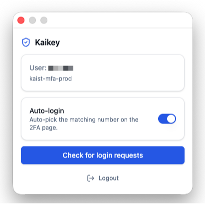

# Kaikey

A Chrome/Chromium browser extension that handles the KAIST SSO 2FA push
authenticator inside the browser, so you don't have to reach for your phone
every time you log in.

<p align="center">
  
</p>

When you arrive at the KAIST SSO login page, Kaikey fills in your ID and
submits the form. When the 2FA challenge page appears, Kaikey reads the
displayed two-digit code, asks the auth server for the pending challenge, and
approves it automatically when the numbers match. KLMS' SSO redirect page is
also clicked through automatically.

You can turn auto-login off and approve manually from the popup instead. The
extension keeps a per-device key locally; no data leaves your machine other
than what KAIST's normal mobile authenticator would already send.

## Features

- One-time setup: open the KAIST registration page from the popup, complete
  registration, then upload the QR-code screenshot. Kaikey decodes it, runs
  the registration handshake, and stores the device key in extension-local
  storage.
- Auto-login (default on): on the SSO login page, fill the ID and click the
  login button. On the 2FA page, read the displayed code, fetch the pending
  challenge, and approve it if it matches.
- KLMS support: on `https://klms.kaist.ac.kr/login/ssologin.php`, follows the
  SSO redirect link automatically.
- Manual mode: turn auto-login off and use the "Check for login requests"
  button in the popup to fetch the challenge and pick the matching number
  yourself. Useful when the request was started from another device.
- Logout removes the registered device from local storage. To stop the device
  from being recognized server-side, also remove it from the KAIST device
  list.

## Install

The extension is not on the Chrome Web Store. Use the unpacked build:

```sh
pnpm install
pnpm build
```

Then in Chrome:

1. Open `chrome://extensions`.
2. Enable Developer mode.
3. Click "Load unpacked" and pick `build/chrome-mv3-prod`.
4. Pin Kaikey from the puzzle-piece menu.

## Setup

1. Click the Kaikey icon to open the popup.
2. Click "Open registration page" and complete the KAIST 2FA registration
   flow (`sso.kaist.ac.kr/auth/twofactor/mfa/regist/...`).
3. The last step shows a QR code. Take a screenshot of it.
4. Back in the popup, click "Upload QR screenshot" and pick the image.
5. The popup will switch to the registered view once the handshake succeeds.

After that, visit any KAIST page that redirects through SSO. Kaikey logs you
in.

## Development

```sh
pnpm dev
```

Loads `build/chrome-mv3-dev` with hot reload. Chrome 130+ will show a Local
Network Access prompt on KAIST pages because Plasmo's dev runtime opens a
WebSocket to `localhost` for HMR. Either allow it for the relevant origins, or
just use the prod build for normal testing.

`pnpm build` produces `build/chrome-mv3-prod`, which has no HMR runtime and no
loopback connections.

## Project layout

- `src/popup.tsx` – setup + registered popup screens (shadcn-ish UI on
  Tailwind).
- `src/background.ts` – central protocol handler. Receives messages from the
  popup and content scripts, runs the registration / auth-check / approve
  calls, and dispatches `chrome.scripting.executeScript` into the page's main
  world when needed.
- `src/lib/auth/` – TypeScript port of the underlying push-authenticator
  protocol: LEA-128 + RSA-OAEP envelope encryption, ECDSA P-256 P1363
  signing, and the verification-number derivation used by the 2FA challenge.
- `src/lib/state.ts` – local storage wrapper for the device key + auto-login
  setting.
- `src/contents/login-page.ts` – content script for the SSO login page.
- `src/contents/twofactor-page.ts` – content script for the 2FA challenge
  page.
- `src/contents/klms-sso-redirect.ts` – content script for the KLMS SSO
  redirect page.

## Security notes

- The device's EC private key is stored in `chrome.storage.local`. It never
  leaves the extension.
- Network calls to `sso.kaist.ac.kr` are made from the background service
  worker so the page's CSP and CORS rules don't apply.
- Approval requires the displayed digits on the 2FA page to match the digits
  the extension derives from the server challenge. Without that match the
  extension does not call the approve endpoint.

## License

MIT.
